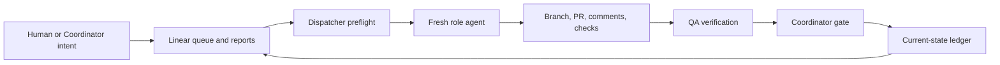
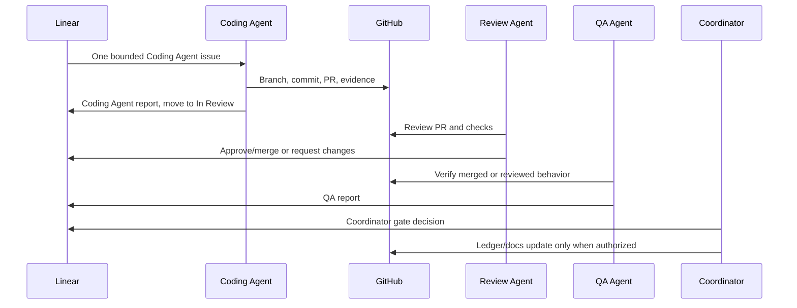

# AI Automation Development Process Presentation

Status: human entrypoint / presentation
Audience: medium technical background
Scope: development workflow, not product feature documentation
Last updated: 2026-06-23

Use this as a 20 to 30 minute walkthrough for people who want to understand how
Project Prompt Library is being developed with AI automation. Each horizontal
rule is a slide boundary.

---

## 1. The Short Version

Project Prompt Library uses AI agents as bounded workflow operators, not as an
uncontrolled coding swarm.

The development process is built around a simple loop:

```text
Linear issue -> fresh role agent -> GitHub PR/evidence -> review -> QA -> coordinator gate -> current-state ledger
```

The product is a small MCP connector, but the more interesting system is the
development workflow: scoped roles, durable evidence, explicit gates, and
automation that is allowed to stop when state is unclear.

Talk track:

- The goal is not "let AI do everything."
- The goal is to make each AI-assisted step reviewable, repeatable, and safe
  enough for a solo project to move quickly without losing the plot.

---

## 2. What This Repository Is Proving

This repository is proving two things at once:

1. A small retrieval-focused ChatGPT Apps / MCP connector can be built in
   narrow, validated slices.
2. A practical AI development workflow can use Linear, GitHub, and repo-local
   docs as the control system for autonomous or semi-autonomous agents.

The product matters, but this deck focuses on the second point: how work is
selected, executed, reviewed, verified, and safely handed off.

---

## 3. The Operating Model



Key idea:

- Linear is the queue and run log.
- GitHub is the durable code and PR evidence trail.
- Repo docs are the rulebook.
- The current-state ledger is the compact "where are we now?" pointer.
- Agents execute roles, not vague intentions.

---

## 4. The Source Of Truth Stack

When sources disagree, the workflow does not guess. It uses an explicit source
order.

The practical reading order is:

1. Current human instruction.
2. `docs/workflows/current-state-ledger.md` for phase, lane, gate, and caveats.
3. `AGENTS.md` for repository-wide boundaries.
4. Role specs in `docs/agents/`.
5. Architecture, roadmap, standards, QA strategy, Linear, GitHub, code, and
   tests as needed.

Why it matters:

- Long docs drift.
- Linear and GitHub move independently.
- Agents need one compact source for "what is currently allowed?"

The ledger is the answer to that problem.

---

## 5. The Role System

The workflow divides agent work into narrow roles:

| Role | Job | Stop rule |
|---|---|---|
| Dispatcher | Select at most one executable issue and hand it off. | Stop when there is no safe candidate. |
| Coding Agent | Implement one bounded issue or docs-only task. | Stop before QA, review, or later-slice work. |
| Review Agent | Review PRs, request changes, approve, and merge when safe. | Stop on unresolved evidence or scope drift. |
| QA Agent | Independently verify behavior, evidence, docs, and tests. | Stop before silently fixing product code. |
| Coordinator Agent | Decide gates and reconcile workflow state. | Stop when evidence is missing or contradictory. |
| AI Automation Expert | Audit automation safety and adoption decisions. | Manual-only; no recurring pickup by default. |

The important design choice is role separation. Each role has a different
authority boundary.

---

## 6. Normal Work Item Lifecycle



The lifecycle keeps product implementation, review, QA, and gate decisions from
collapsing into one long agent thread.

---

## 7. Dispatcher Philosophy

The dispatcher is deliberately small.

It may cheaply inspect:

- the current-state ledger;
- Linear queue metadata, labels, blockers, and recent comments;
- recent/open GitHub PR metadata only when needed for drift detection.

It must not inspect full source code, PR diffs, CI logs, review threads, or
broad project docs before handoff.

Why:

- Most automation runs should end quickly when nothing is executable.
- Expensive context belongs to the fresh role agent after one issue is selected.
- Queue selection should be boring and auditable.

---

## 8. Candidate Mode Versus Claim Mode

Candidate mode is the default.

```text
candidate mode:
  select one candidate
  emit ROLE_HANDOFF_CANDIDATE
  do not mutate Linear
  stop
```

Claim mode is intentionally off until proven and adopted.

```text
claim mode:
  select one candidate
  write a dispatcher claim marker
  verify unique ownership
  emit ROLE_HANDOFF
  require a handoff consumer
  require terminal markers
```

Why candidate mode first:

- It cannot strand an issue in a claimed or half-started state.
- It lets humans review the selected work before giving automation more power.
- It keeps failure recovery simple.

---

## 9. The Live Claim Contract

When claim mode is eventually adopted, Linear comments become the lock system.

Canonical live claim marker:

```text
AGENT RUNNING
claim_id:
claim_expires_at:
role:
issue:
```

Canonical terminal markers:

```text
AGENT COMPLETE
AGENT BLOCKED
AGENT CLAIM RELEASED
AGENT CLAIM EXPIRED
```

The workflow avoids using Linear state alone as a lock. `In Progress` can mean a
real active run, but it can also mean reviewed work waiting for fixes. Claim
markers are the reliable active-work signal.

---

## 10. State Checkpoints

The workflow has one strict rule for state-changing handoffs:

```text
No slice handoff without a State Checkpoint.
```

When a slice or lane changes, the closing evidence must record exactly one of:

```text
ledger updated in this PR/issue
ledger already correct
checkpoint recorded in issue/PR/Linear evidence
state-repair issue created/linked: PL-xxx
```

Repo mutation or a state-repair PR is required only when the current-state
ledger or another routing-critical doc is stale or ambiguous.

Why:

- Without this, Linear and GitHub can move forward while repo-local workflow
  docs keep describing the old world.
- Dispatchers and future agents then make decisions from stale state.
- The checkpoint turns "remember to update the docs" into an executable control.

---

## 11. Evidence Model

Every role report is expected to separate evidence from recommendation.

Useful evidence classes:

| Evidence class | Examples |
|---|---|
| Linear evidence | Issue state, labels, blockers, comments, live claims. |
| GitHub evidence | PR state, head SHA, merge SHA, comments, checks. |
| Repository evidence | Path, branch, diff, docs, command results. |
| Workflow evidence | Ledger facts, dispatcher mode, State Checkpoint outcome. |
| Boundary evidence | V1 non-goals, allowed tools, forbidden runtime scope. |

The process only works if reports say what was actually observed and what was
inferred.

---

## 12. Quality Gates

The default local deterministic gate includes:

```bash
npm run typecheck
npm run lint
npm run format:check
npm run test
npm run test:unit
npm run test:contract
npm run test:golden
npm run validate-prompts
```

These checks are not theater. They protect the project from common AI-assisted
failure modes:

- wrong payload shape;
- unsafe prompt validation behavior;
- metadata leakage into model-visible results;
- source/cache regressions;
- later-slice scope drift.

QA and Coordinator reports must say which checks ran, which were skipped, and
why.

---

## 13. Learning Without Hidden Memory

Agents do not privately "learn" new project rules.

The durable learning loop is:

```text
agent run
  -> learning candidate in report
  -> coordinator or human review
  -> accepted rule goes into one canonical doc
  -> learning log records the decision
```

This keeps the project understandable to people who were not in the original
chat thread.

Active rules live in role specs, the current-state ledger, or workflow docs.
History lives in `docs/agents/learning-log.md`.

---

## 14. What Is Deliberately Not Automated

The workflow is conservative by design.

It does not currently allow automation to:

- make AI Automation Expert issues recurring-pickable;
- turn claim mode on by documentation alone;
- create new product runtime behavior;
- skip Coding, Review, QA, or Coordinator gates;
- treat stale docs as harmless when they affect queue selection;
- continue when multiple executable candidates remain ambiguous;
- close state-changing work without a State Checkpoint.

These are brakes, not missing features.

---

## 15. Why The AI Automation Expert Exists

The AI Automation Expert is a manual-only safety role for the automation system
itself.

It audits:

- dispatcher candidate selection;
- claim-mode readiness;
- handoff-consumer behavior;
- State Checkpoint routing;
- worktree safety;
- monitor and heartbeat behavior;
- automation adoption, rollback, and compaction decisions.

It does not implement product code and does not replace the Coordinator. Its
job is to make automation safer before more autonomy is granted.

---

## 16. Human Entry Points

If you are new to this repository, start here:

1. `README.md` for the product snapshot.
2. `docs/workflows/current-state-ledger.md` for current phase and lane.
3. `docs/agents/README.md` for the role system and queue contract.
4. `docs/workflows/dispatcher-and-learning-setup.md` for the automation model.
5. `docs/agents/ai-automation-expert.md` for automation safety audits.

If you only have five minutes, read the ledger and the role table in
`docs/agents/README.md`.

---

## 17. A Concrete Example

Imagine a new approved docs/workflow issue:

1. Linear issue is created with the right role marker and labels.
2. Dispatcher candidate mode sees exactly one safe candidate.
3. A fresh role agent reads the required docs and issue context.
4. The agent edits only the authorized docs.
5. The agent creates a branch and PR.
6. Review Agent checks the diff, evidence, and state impact.
7. If approved, the PR is merged and Linear is updated.
8. If the change affects the lane or queue, the State Checkpoint is recorded.

At every step, the workflow prefers a visible stop over a silent assumption.

---

## 18. The Design Tradeoff

This workflow spends more effort on process than a typical solo repo.

That is intentional because AI agents are fast enough to make small mistakes
large unless the operating state is explicit.

The payoff:

- work is resumable after chat compaction;
- decisions are traceable in Linear and GitHub;
- stale-state problems are surfaced instead of buried;
- role agents stay narrow;
- the human can inspect the system without reading every prior conversation.

---

## 19. Current Automation Posture

As of the current ledger:

- M4 local MVP is complete.
- The next product lane is Slice 5.1 personal-use trial planning.
- Dispatcher and role-learning setup remain proposed unless explicitly adopted.
- Claim mode remains off.
- AI Automation Expert is manual-only and not recurring automation-pickable.

This means the repository is automation-ready in structure, but deliberately
careful about increasing autonomy.

---

## 20. Closing Message

The development process is the product of this repository as much as the code
is.

The core pattern is:

```text
small role + exact issue + durable evidence + explicit gate + state checkpoint
```

That pattern is what lets AI assistance stay useful without becoming
unreviewable.

---

## Reference Map

- Repository guardrails: [`../../AGENTS.md`](../../AGENTS.md)
- Current state: [`current-state-ledger.md`](current-state-ledger.md)
- Agent roles: [`../agents/README.md`](../agents/README.md)
- Dispatcher spec: [`../agents/dispatcher.md`](../agents/dispatcher.md)
- AI Automation Expert spec: [`../agents/ai-automation-expert.md`](../agents/ai-automation-expert.md)
- Dispatcher and learning setup:
  [`dispatcher-and-learning-setup.md`](dispatcher-and-learning-setup.md)
- Learning log: [`../agents/learning-log.md`](../agents/learning-log.md)
- QA strategy: [`../qa/test-strategy.md`](../qa/test-strategy.md)
